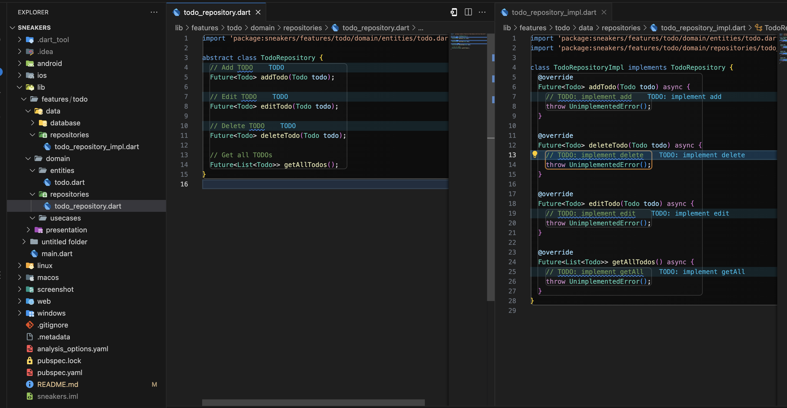
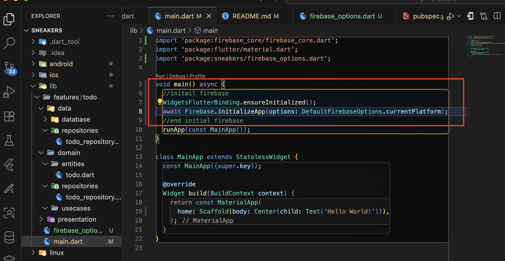
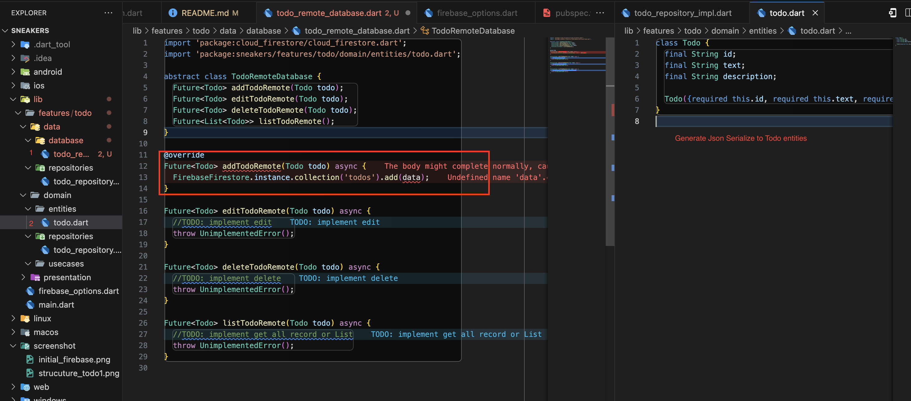
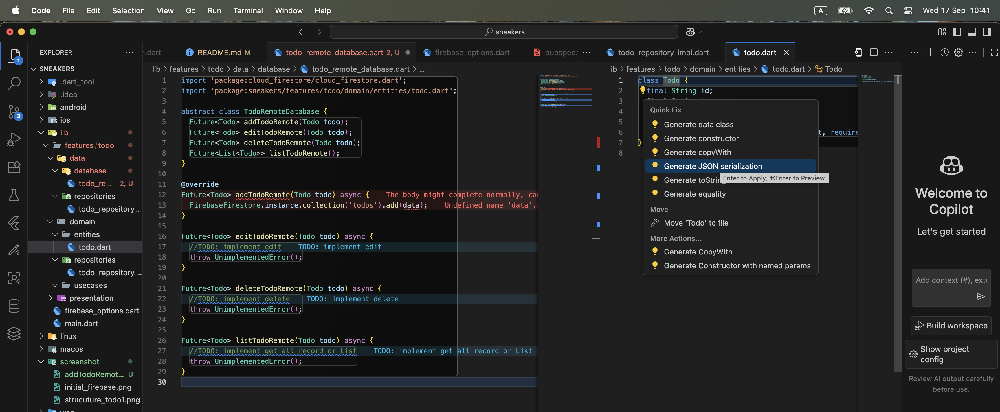

# sneakers
https://www.youtube.com/watch?v=6jjaVWEC9Qw&list=PLmMaURE6dvEDdhQumUEUiYXeQ2HQ9fmCS&index=3
A new Flutter project.
```
flutter create -e sneakers --org "com.toey"
```

# Create Clean strucuture

# package 
1. connect firebase to flutter using comand run

```
brew tap firebase/tap
brew install firebase-cli
flutterfire --version
firebase login
firebase projects:list --json

sudo gem install xcodeproj
sudo gem update --system

flutterfire configure
```

2. add firebase package to depedency

firebase_core: ^4.1.0
cloud_firestore: ^6.0.1

dartz: ^0.10.1 (allow to return type Either)

3. initial firebase to main() app

4. Add todo remote and link to todo_remote_impl.dart


